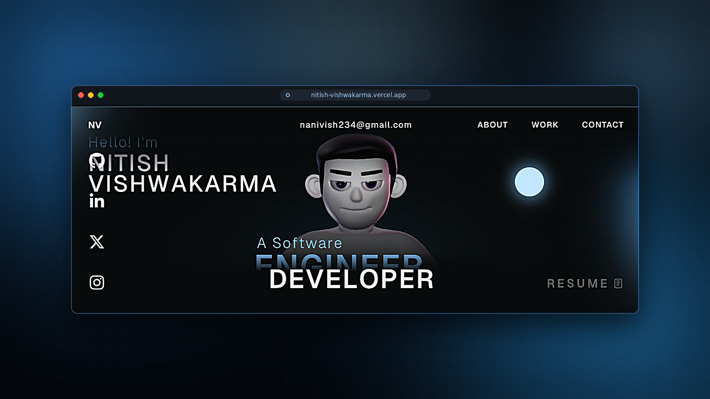

<div align="center">

# 🚀 Nitish Vishwakarma — Portfolio Website

### An interactive, animation-driven personal portfolio built with React, Three.js, and GSAP

[](https://react.dev)
[](https://www.typescriptlang.org)
[](https://vitejs.dev)
[](https://threejs.org)
[](https://gsap.com)
[](#-license)

[Live Demo](https://portfolio-five-mu-m9kl443jln.vercel.app/) · [Report Bug](../../issues) · [Request Feature](../../issues)

</div>

---

## 📖 Overview

This is the source code for my personal developer portfolio — a fully responsive, interactive site combining **3D graphics**, **scroll-driven animation**, and clean full-stack fundamentals. It's built to showcase projects, skills, and experience through a smooth, immersive user experience rather than a static page.

Feel free to explore the code, fork it, and use it for learning and inspiration.

---

## ✨ Features

- 🎮 **Interactive 3D character model** rendered in real time with Three.js / React Three Fiber
- 🌀 **Buttery-smooth scroll animations** powered by GSAP, ScrollTrigger, and ScrollSmoother
- ✂️ **Animated text reveals** using GSAP SplitText
- 📱 **Fully responsive** across desktop, tablet, and mobile
- ⚡ **Optimized performance** with Vite's fast build pipeline and Draco-compressed 3D models
- 🎨 **Custom cursor interactions** and micro-animations throughout
- 🧩 **Modular component architecture** for easy customization and extension

---

## ⚙️ Tech Stack

| Category | Technologies |
|---|---|
| **Core** | React · TypeScript · Vite |
| **3D & Graphics** | Three.js · React Three Fiber · Drei · WebGL · Draco Compression |
| **Animation** | GSAP · ScrollTrigger · ScrollSmoother · SplitText |
| **Styling** | CSS3 |
| **Deployment** | Vercel / Netlify |

---

## 🚀 Getting Started

### Prerequisites

- Node.js `v18+`
- npm (or yarn/pnpm)

### Installation

```bash
# Clone the repository
git clone https://github.com/Nitish204/portfolio.git

# Navigate into the project
cd portfolio

# Install dependencies
npm install
```

### Development

```bash
npm run dev
```

The site will be available at `http://localhost:5173`.

### Production Build

```bash
npm run build
npm run preview
```

---

## 📁 Project Structure

```
portfolio/
├── public/
│   ├── models/          # 3D model assets (.glb)
│   └── images/          # Static images
├── src/
│   ├── components/      # React components (Landing, About, Work, Career, Contact...)
│   ├── components/utils/# Animation & effect utilities
│   ├── data/             # Static data used across components
│   └── main.tsx          # App entry point
├── index.html
└── vite.config.ts
```

---

## 🎨 Assets Usage

Some 3D assets included in this repository are free to use for learning purposes.

However:

- The original 3D avatar used on the live portfolio is **not included** in this repository.
- That avatar is a custom asset created over roughly a month.
- It is not open source, but reuse of the version on the live site is permitted.

For official GSAP Club plugins, refer to the [GSAP installation docs](https://gsap.com/docs/v3/Installation/).

---

## 🖼️ Preview



---

## 📬 Contact

**Nitish Vishwakarma**

- 📧 Email: [nanivish234@gmail.com](mailto:nanivish234@gmail.com)
- 💼 LinkedIn: [linkedin.com/in/vishwakarmanitish](https://linkedin.com/in/vishwakarmanitish)
- 🐙 GitHub: [@Nitish204](https://github.com/Nitish204)
- 🌐 Portfolio: [portfolio-five-mu-m9kl443jln.vercel.app](https://portfolio-five-mu-m9kl443jln.vercel.app/)

---

## 📄 License

This project is licensed under the [MIT License](LICENSE) — feel free to use it for learning, with credit appreciated.

---

<div align="center">

If you found this project useful or inspiring, consider giving it a ⭐

</div>
